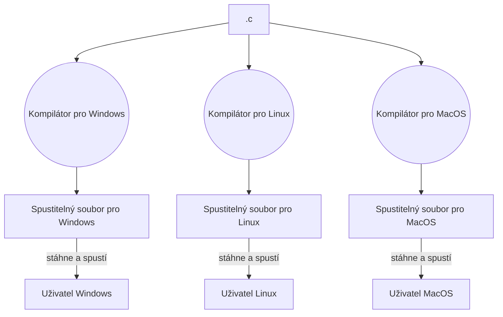
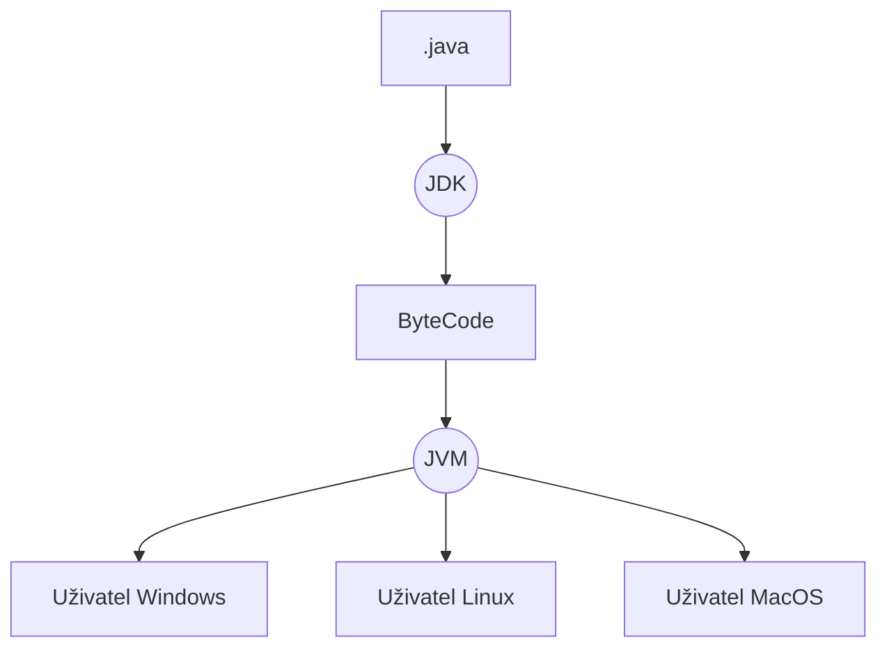

## Zápočet

- Vypracovat všechny úkoly.
	- Na každý máte dva týdny + případné opravy
	- Řešení mi budete ukazovat na přímo na semináři
		- Stručně si ho probereme a popovídáme si
- Párkrát se bude psát 5 minutovka
	- Je potřeba alespoň 8 bodů z 12 za semestr.
	- Dám vám vždycky dopředu vědět.


## Úvod do jazyka Java


- Java je objektový programovací jazyk s procedurálními a funkcionálními prvky

	> Objektové programování teprve budete dělat v PARA 3
	> Procedurální a funkcionální programování jste už dělali

- Java je velmi populární jazyk
- Používá se pro velké informační systémy, webové servery apod.
- Výhody:
	- Přenositelnost -> jakmile program jednou sestavíte, spustíte ho na všech možných zařízeních
		- Když sestavíte program z jazyka C, spustíte ho je na počítačích se stejným systémém, jakou jste použili pro sestavení
		- z Java kódu se sestavý tzv. **byte-code** -> ten systém spustit neumí
			- Potřebujete tzv. **JVM**, což je program, už napsaný třeba v C, který si na libovolném zařízení nainstaluju, a který umí spustit **byte-code**
	- Bezpečnost
		- Narozdíl od C nebo C++, nepoužívá ukazatele
			- Tím automaticky eliminuje veškeré problémy s pamětí
		- Paměť je automaticky alokována a uvolňována JVM (Garbage Collector)








- Java je především **objektový jazyk**
- K programu a datům přistupuje stejně jako člověk, který uvažuje o předmětech z reálného světa
	- **Automobil** je _objekt_, který se skládá z jiných objektů
		- Motoru
			- Písty
			- Hřídel
			- ...
		- Dveří
		- Kol
		- Sedaček
		- ...
- Stejně tak v Javě vytváříme objekty.
	- Ty se mohou skládat z jiných objektů
	- Zároveň můžeme jednodušše práci rozdělit mezi více programátorů -> každý bude pracovat na svém objektu
- Každý **objekt** má danou zodpovědnost
	- **Automobil** dopravit cestující z místa A do místa B
		- **Motor**: roztáčet kola, měnit převody, ...
- Pokud jsou zodpovědnosti správně definované, můžeme objekt použít na více místech
	- Např. objekt **Motor** může využít i _loď_, _autobus_, _lanovka_, ...


### Praktický příklad - Rezervační systém pro kurty

- Objekt **Rezervace** se skládá z:
	- *Uživatele*
		- Jméno
		- Email
		- Datum narození
	- *Časového rozsahu*
		- Od
		- Do
	- *Datum*
	- *Rezervovaný kurt*
		- Název
		- Poloha

- Objekt **Rezervační systém** se skládá z:
	- _Vytvořených rezervací_ -> Množina objektů **Rezervace**
	- _Dostupných kurtů_


## Procedurální programování

- Nejprve si ukážeme procedurální prvky jazyka Java

### Základní program a "Hello world!"

```java

class Program {
	public static void main(String[] args) {
		System.out.println("Hello world!");
	}
}

```


#### Deklarace proměnných

- Než proměnnou můžeme použít, musí být deklarována ->
	- určen název a 
	- množinu hodnot, které může nabývat -> **Typ**

```java
<typ> <nazev>;
<typ> <nazev> = <hodnota>;
final <typ> <nazev> = <hodnota>;
```

```java
// deklarace proměnné bez počáteční hodnoty, která může nabývat hodnot od -2^32 do 2^32
int a;

// proměnná s počáteční hodnotou 1
int b = 1;

// konstanta
final int c = 42;

// pokud je typ zřejmý z počáteční hodnoty, můžeme použít klíčové slovo `var`, které typ automaticky doplní
var d = 21;
```


### Komentáře

```java

// jednořádkové komentáře jsme už viděli výše

/*
 * Stejně tak existují i 
 * víceřádkové komentáře.
 */

```


### Datové typy

Máme dva druhy: 
- Primitivní -> reprezentace čísla, pravdivostní hodnoty, písmena
- Třídy a pole -> budeme se zabývat později

```java

byte bt = 128; // od -128 do 127

short s = 512; // od 32 768 do 32 767

int a = 1; // od -2^31 do 2^31 - 1

long b = 30000000; // od -2^63 do 2^63 - 1

float c = 3.14; // čísla s plovoucí desetinnou čárkou

double d = 1.618033988749895; // stejné jako float, ale má větší přesnost

boolean is_valid = true; // pravdivostní hodnota

char e = 'a'; // písmeno. Z pole (listu) písmen vytvoříme řetězec

```


### Výrazy

```java

int a = 40;

// a + 2 je výraz
int b = a + 2;


// výraz pro výčet obvodu obdelníka se stranami délek `a` a `b` 
int o = (a + b) * 2;

int r = 10;

// výraz pro výpočet plochy kruhu o poloměru `r`
double s = 3.14 * r * r;

```


Máme i operace, které kombinují dvě operace do jedné:

```java

int a = 4;

int b = ++a;

System.out.println("a: " + a + " b: " + b);

int a = 4;

int b = a++;

System.out.println("a: " + a + " b: " + b);

```

Výstup:

```java
a: 5 b: 5
a: 5 b: 4
```


### Řízení výpočtu

```java

// podminka je výraz, který se vyhodnotí na pravdivostní hodnotu
if(podminka) {
	// kód, který se vykoná, pokud se podminka vyhodnotí na true
}

// můžeme větvit - vždy se ale spustí jen jedna větev
if(podminka) {
	// pokud plati podminka, zbytek nas nezajima
} else if(jina_podminka) {
	// pokud neplati podminka, ale plati jina_podminka
} else {
	// pokud neplati podminka ani jina_podminka
}


```


Příklad, kdy chceme promněnné `x` přiřadit její absolutní hodnotu:

```java

int x = - 100;
int abs = 0;

if(x < 0) {
	abs = -x;
} else {
	abs = x;
}

```


Další možnost jak větvit program je pomocí konstrukce `switch-case`. Switch vyhodnotí náš výraz a porovnává jeho hodnotu s hodnotami jednotlivých `case`. Pokud se rovnají, vykoná se daná větev pod `case`.

Pozor: pokud na konci `case` nebude `break`, může se vykonat více větví.


```java

switch(výraz) {
	case hodnota1:
		// pokud se hodnota výrazu = hodnota1
		break; // je třeba použít klíčové slovo break, jinak by se porovnávali i následující větve
	case hodnota2:
		// pokud se hodnota výrazu = hodnota2
		break;
	default:
		// pokud se hodnota výrazu nerovná žádnému z case
}

```


```java

int a = 5;

switch(a) {
	case 1:
		System.out.println("jedna");
		break;
	case 2:
		System.out.println("dva");
		break;
	case 3:
		System.out.println("tři");
		break;
	case 4:
		System.out.println("čtyři");
		break;
	default:
		System.out.println("Nekonečno");
}

if(a == 1) {
	System.out.println("jedna");
} else if(a == 2) {
	System.out.println("dva");
} else if(a == 3) {
	System.out.println("tři");
} else if(a == 4) {
	System.out.println("čtyři");
} else {
	System.out.println("Nekonečno");
}

```


`break` se nepoužívá, pokud máme více různých možností pro jednu větev:

```java

int a = 3;
switch(a) {
	case 2: // zamitne
	case 4: // zamitne
	case 6: // zamitne
	case 8: // zamitne -> nejde do větve
		System.out.println("Sudy"); // NEvykona telo
		break;
	case 1: // zamitne
	case 3: // shoduje se!!!
	case 5: // ignoruje
	case 7: // ignoruje
	case 9: // ignoruje
		System.out.println("Liche"); // vykona telo
}

// výstup:
// Liche

```


#### Switch jako výraz

Občas se hodí použít switch jako výraz, který se vyhodnotí na nějakou hodnotu. Například, pokud bychom nechtěli vypsat číslo, ale pouze vrátit daný řetězec:

```java

int cislo = 3;

String cislo_str = switch(cislo) {
	case 1 -> "jedna";
	case 2 -> "dva";
	case 3 -> "tři";
	case 4 -> "čtyři";
	default -> "nekonečno";
};

System.out.println(cislo_str); // tři

```

> V případě `switch-case` jako výraz je nutné mít větev pro všechny různé hodnoty, které vyhodnocením výrazu mohou nastat. Popř. řešit zbytek pomocí `default`


### Cykly

```java

while(výraz) {
	// vykoná se, pokud je podmínka platná.
	
	// ...
	
	// výraz se opět vyhodnotí a pokud je stále platný, vykoná se tělo znovu
}

```


```java

int i = 1;
while(i <= 20) {
	System.out.println(i);
	i++;
}

```


Existuje ještě alternativa, která tělo vykoná vždy alespoň jednou:

```java

do {
	// poprvé se vykoná vždy
	
	// poté se vykoná jen, pokud stále platí podmínka
} while(podmínka)

```

Užitečná je třeba při ověřování vstupu:

```java

int input = 0;

do {
	System.out.println("Zadejte číslo 1");
	input = read_console_input();
} while(input != 1);

System.out.println("Hurá");


```


Další užitečnou konstrukcí je `for` cyklus:

```java

for(<initializace>; <podmínka>; <iterace>) {
	// tělo
}

// jakmile je podmínka == false

```

Ta usnadňuje práci s **řídící promněnnou**:

```java

// year je tzv. řídící promněnná
for(int year = 2000; year < 2025; year = year + 1) {
	System.out.println("Rok: " + year);
}

```

- `<initializace>` nám umožní nastavit počáteční hodnotu
- `<podmínka>` je výraz, který ideálně bere v potaz právě naši řídící promněnnou. 
	- Jakmile se vyhodnotí na `false`, tělo se už nevykoná a skáčeme až za `for`
- `<iterace>` jak se má řídící promněnná upravit po každé iteraci.


#### Ukončovací podmínky

- Každý cyklus by měl mít ukončovací podmínku.
- Pokud máme nekonečnou smyčku a její ukončení je speciální případ, můžeme použít příkaz `break`, který nejbližší cyklus, ve kterém se nachází, automaticky ukončí:

```java

while(true) {

	// část těla, která se ještě vykoná, i když je player_pressed_esc() == true
	// ...

	if(player_pressed_esc()) {
		break;
	}
	
	// tato část těla (po příkazu break), už se nevykoná, pokud byl player_pressed_esc() == true
	// ...
}

```


#### Continue

Pokud chceme rovnou, třeba v půlce vykonávání těla, přeskočit na další iteraci, můžeme použít příkaz `continue`:


```java

while(true) {
	if(sheeps_are_fed()) {
		continue; // rovnou skočí na další iteraci
	}
	
	// pokud jsou danou iteraci ovce nakrmené, tak už krmení nedostanou
	feed_sheep();
}

```