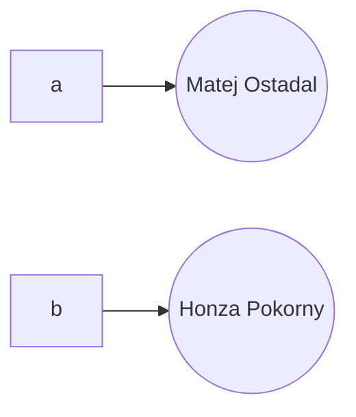
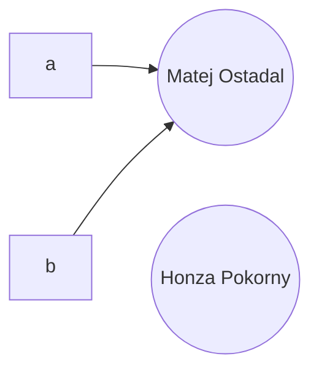

# Další vlastnosti objektového modelu jazyka Java


## Menší písmenka

- Na první dva semináře
	- Jak vytvořit objekt
	- Jak zapsat smyčku
	- Apod...
- Bude na papír -> papír dostanete, tužku svoji


# Další vlastnosti objektového modelu jazyka Java

- Aneb jaké užitečné objekty v Javě máme
- Osvěžíme si vlastnosti objektů a tříd
	- Uvidíme, co to znamená pro objekty v Javě


## Rětězce

- Už jsem se setkali
- Datový typ `String`
- Jedná se o třídu, proto začíná velkým písmenem

- Má konstruktor:

```java

String str = new String("Hello world");

// ale vy znáte spíše tuto syntax
String str2 = "Hello World";

// Uvedomte si ale, ze to pouze volá konstruktor

```


- Má spousty dalších užitečných metod:
	- Můžeme indexovat (získat n-té písmenko) `str.charAt(n)`
	- najdi znak a vrať mi jeho index: `str.indexOf('w') == 6`
	- vrať mi podřetězec: `str.substring(od, do)`

```java

        String hello = "Hello World";

        System.out.println(hello.charAt(6)); // 'W'

        System.out.println(hello.indexOf('W')); // 6
        System.out.println(hello.indexOf("World")); // 6

        System.out.println(hello.indexOf('l')); // 2
        System.out.println(hello.lastIndexOf('l')); // 9

        System.out.println(hello.substring(6)); // World
        System.out.println(hello.substring(6, 11)); // World

        System.out.println(hello.toLowerCase()); // hello world
        System.out.println(hello.toUpperCase()); // HELLO WORLD

        System.out.println(hello.length()); // 11


```


**Záludnost:**
- Běžně ověřujeme rovnost hodnot dvou proměnných pomocí operátoru `==`
- Promněnná ale neukládá přímo objekt, ale pouze odkaz na něj
- Pokud porovnáme dva objekty pomocí `==`, dostaneme `true` právě, když jsou **odkazy** stejné

```java

User a = new User("Matej", "Ostadal");
User b = new User("Honza", "Pokorny");

System.out.println(a == b); // false

a = b;

System.out.println(a == b); // true

a.firstName = "Josef";

System.out.println(b.firstName); // Josef

```




`a = b` udělá:



1. Honza Pokorny bude JVM eventuélně smazán, protože na něj už nic neukazuje
2. Když změníme atributy objektu `b`, logicky přepíšeme i atributy objektu `a`


**Stringy**:
- String v Javě je optimalizovaný
	- Alokuje se obrovský String na pozadí, aby se nemusela pokaždé alokovat paměť
	- Spoustu stringů ale dostane stejný odkaz (právě na obrovský řetězec)
	- Proto, i když bychom měli dva různé objekty Stringu, může se stát, že pomocí `==` se budou rovnat!
- Minule jsme měli podobný problém s naším objektem
	- Jak tedy elegantně porovnávat hodnoty na adrese, a ne pouze adresu?


**Metodou**: `equals`

```java

String hello = "Hello";
String hello2 = "Hello";
String world = "World";

System.out.println(hello == world); // true nebo false
System.out.println(hello.equals(world)); // false
System.out.println(hello.equals(hello2)); // true

```


### StringBuilder

- String v Javě je neměnný
- Pokud chceme String pouze upravit, musíme vytvořit nový

```java

// vytvářím dvě instance
String str = new String("Hello world").toUppercase();

// nebo sjednocení -> každá operace vytvoří nový objekt -> 5 objektů

String str = new String("Hello") + new String(" ") + new String("World");

```

- Vytvářet tolik objektů je sice intuitivní a relativně bezpečné, ale dost neefektivní
- Jak by mohla vypadat metoda, která by to zefektivnila?


**StringBuilder**
- Vytvořili bychom jeden velký string a postupně bychom kopírovali jednotlivé stringy do něj -> 1 alokace
- K tomu slouží třída `StringBuilder`

```java

StringBuilder stringBuilder = new StringBuilder();

for(int i = 0; i < 1000; i++) {
	stringBuilder.append("Hello");
	stringBuilder.append(" ")
	stringBuilder.append("World");
}

// pomoci metody toString dostaneme vysledny retezec
System.out.println("Vysledek: " + stringBuilder.toString());

```


## Pole

- Často potřebujeme pracovat s celými soubory objektů
- K tomu v Javě (a jiných jazycích) máme  **pole**
- Objekt, který obsahuje soubor objektů stejného typu
	- K jednotlivým objektům přistupujeme pomocí indexu


```java

// musíme předem určit velikost -> 10
int[] a = new int[10];

// muzeme vytvaret pole objektu
Car[] b = new Car[10];

// existuje syntaxe pro initializaci
// vytvori pole o dvou prvcich typu `Car`
Car[] c = {
	new Car("Honda", 50),
	new Car("Skoda", 80)
};

System.out.println(c[0].name); // Honda
System.out.println(c[1].name); // Skoda

c[0].name = "Mercedes";

System.out.println(c[0].name); // Mercedes

```


```java

int[] sudaCisla = new int[10];

// muzeme i prirazovat
for(int i = 0; i < sudaCisla.length; i++) {
	System.out.println(sudaCisla[i]);
}

// syntax pro for-each kazdeho prvku v poli
for(int cislo : sudaCisla) {
	System.out.println(cislo);
}

```


## Metody a atributy tříd

- Dosud jsem uvažovali pouze metody a atributy objektů
- Co když ale některá metoda nepotřebuje, aby existoval nějaký objekt?

	- Například globální čítač
	- Obecný výpočet, např. `sqrt`, `pow` apod. v matematice

- Můžeme atribut nebo metodu označit jako `static`
- Takový atribut pak má pro všechny instance stejnou hodnotu -> atribut **třídy**
- Taková metoda nemůže pracovat s konkrétní instancí -> metoda **třídy**
- Bez `static` je to atribut a metoda **objektu**


- Např. pro čítač instancí
- Vytvoříme atribut třídy, např. `carCounter` a vždy ho v konstruktoru inkrementujeme

```java

class Car {
	private static int carCounter;
	
	private String brand;
	private int maxSpeed;
	
	private int speed;
	
	public Car(String brand, int maxSpeed) {
		this.brand = brand;
		this.maxSpeed = maxSpeed;
		this.speed = 0;
		
		carCounter++;
	}
	
	
	public static int getNumberOfCars() {
		// ve statické metodě nemůžeme používat `this`. Proč?
		// this.speed = 0;
		return carCounter;
	}

	// ...
}

```


```java

System.out.println(Car.getNumberOfCars()); // 0

Car car = new Car("Skoda", 80);

System.out.println(Car.getNumberOfCars()); // 1

```


- `main` je metoda třídy: je `static`


## Návrhové vzory

- Konkrétní příklady

**Singleton**:
- Třída, která má pouze jednu instanci společnou pro celý program
- Příklad: **logger** -> třída, která spravuje události v programu pro debugování
	- Takové ty zprávy: `[12:34] Objekt X udělal Y`
	- Populární metoda pro debugování :)
	- Často vypisujeme do souboru
		- Když uživatel dostane error, může soubor vzít a poslat vývojářům, aby věděli, co se dělo pod kapotou
		- Podobný princip jako černá skříňka
- Chceme zajistit: aby existovala jen jedna instance přístupná odkudkoliv z programu => Singleton

