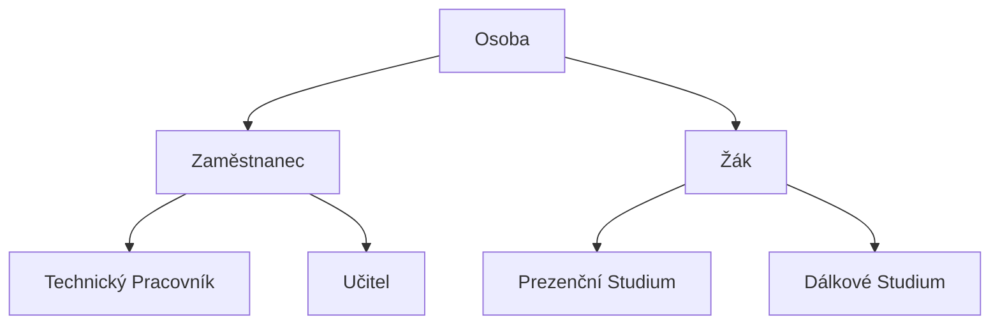
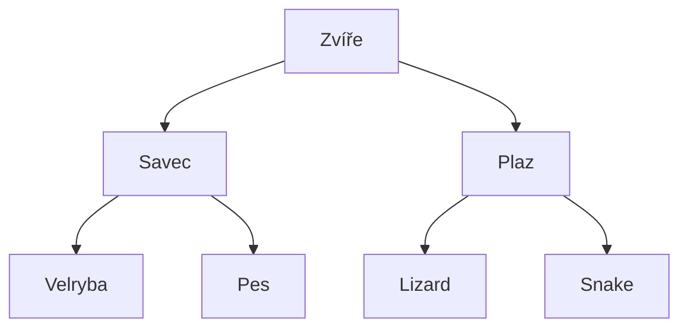
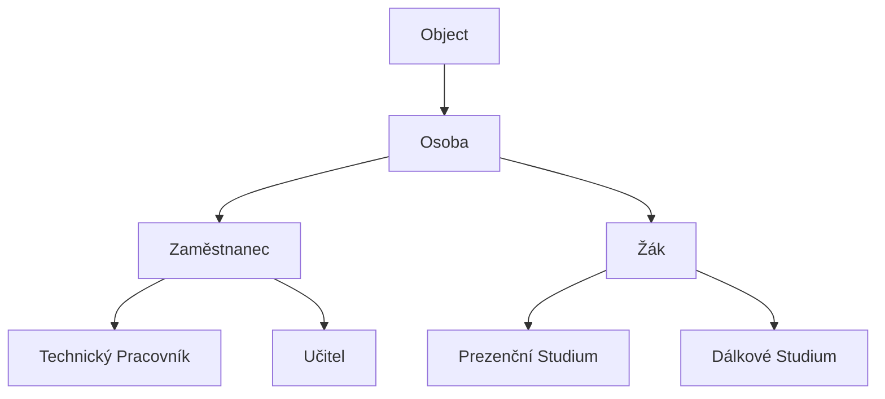

# Písemka

- Na 10 minut
- Jak jste dopadli se dozvíte příště


# Dědičnost

- Na minulém semináři jsme si ukázali **skládání objektů**
- Sdílené rozhraní jsme abstrahovali do logického celku: 
	- `Driveable`:
		- obsahoval metody pro řízení
		- libovolná třída může toto rozhraní implementovat a my ji pak budeme moct řídit jako auto
	- `Sortable`:
		- mohla by obsahovat metodu pro porovnání, a pole těchto objektů bychom mohli snadno seřadit


- Dnes se podíváme na dědičnost
	- Třída A zdědí všechny členy třídy B
	- Může rozhraní rozšiřovat o vlastní členy
	- Takový vztah mají třeba **Zaměstnanec** a **Učitel**.
		- **Učitel** je vždy **zaměstnanec**, ale ne všichni **zaměstnanci** jsou **učitelé**
		- **Učitel** může rozšířit třídu **Zaměstnanec**, například o předměty, které učí


```java

class Employee {
	private String name;
	
	private int dateOfBirth;
	
	private int wagePerHour;
	
	public int hoursWorked;
	
	public int calculateWage() {
		return hoursWorker * wagePerHour;
	}
	
	public String getName() { return name; }
	public void setName(String value) { this.name = value; }
	
	// ...
}


class Teacher extends Employee {
	// zatím ponechejme prázdné
	
	public void sayHello() {
	}
}


```


```java

// Opět se můžeme na instanci typu `Teacher` koukat, jako na instanci typu `Employee`
Employee employee = new Teacher();
employee.sayHello(); // err

Teacher teacher = new Teacher();
teacher.sayHello(); // ok

// zdědili jsme metody
teacher.setName("Tomas");

// .. i atributy
teacher.hoursWorked = 0;

```


```java
// opět nám to umožní si zjednoduššit metody
int calculateTotalWage(Employee[] employees) {
	int sum = 0;
	for(var employee : employees) {
		sum += employee.calculateWage();
	}
	
	return sum;
}

```


- Pokud třída `A` je pouze obecnější verze třídy `B`, tak může `A` dědit ze třídy `B`
	- Zaměstnanec je obecnější než Učitel, proto může učitel dědit ze zaměstnance
- V ten moment třída `A` získává všechny vlastnosti třídy `B`
	- Tuto zděděnou funkcionalitu může rozšířit a nebo také změnit
- Třída, která dědí, se nazývá **potomek**
- Třída, ze které dědí, se nazývá **rodič**


```java

class Teacher extends Employee {
	private Subject[] subjects;
	private String room;
	
	public String getRoom() {
		return room;
	}
	
	public void setRoom(String room) {
		this.room = room;
	}
	
	// ...
}


// ...


Employee employee = new Teacher();
employee.getRoom(); // error: Employee člen jménem `getRoom` nemá

Teacher teacher = new Teacher();
teacher.getRoom(); // funguje 


```


- Potomek může chování i změnit:
	- Např. učitel může mít počítané prémie podle počtu předmětů, které učí:


```java

class Employee {
	private String name;
	
	private int dateOfBirth;
	
	private int wagePerHour;
	
	public int hoursWorked;
	
	public int calculateWage() {
		System.out.println("Employee");
		return hoursWorker * wagePerHour;
	}
	
	public String getName() { return name; }
	public void setName(String value) { this.name = value; }
	
	// ...
}

class Teacher extends Employee {
	private Subject[] subjects;
	private String room;

	// zevnitř potomka ale nevidíme `private` členy rodiče!
	// naštěstí máme veřejné členy
	public int calculateWage() {
		System.out.println("Teacher");
		return (1.0 + subjects.length() / 100) * getHoursWorked() * getWagePerHour();
	}
}

```

```java

// nyní mějme scénář
Employee teacher = new Teacher();
teacher.calculateWage(); // Output: Teacher
// Metoda `calculateWage` ze třídy `Employee` se vůbec nezačne vykonávat
// Při volání `calculateWage` jdeme v hierarchii postupně po rodičích, dokud metodu nenajdeme


Employee employee = new Employee();
employee.calculateWage(); // Output: Employee

```


## Hierarchie

- Pomocí dědičnosti tvoříme celé hierarchie
	- Promněnné typu `A` můžu přiřadit kteroukoliv třídu, která z ní, i tranzitivně, dědí
	- Promněnné typu `Osoba` můžu přiřadit objekt typu `Učitel`, i když to není přímý potomek







- Tohle je spíše abstraktnější příklad
	- Pokud neplánujete programovat opravdu divokou Zoo


## Objekt

- Pokud přímo nespecifikujete, ze které třídy dědíte, automaticky dědíte ze třídy `Object`




```java

// takze ano, muzete udelat i toto

Object teacher = new Teacher();

// ale nedostanete se k zadnemu rozhrani Teacher

```


## Skládání vs. Dědičnost

- Velmi doporučuju toto video
[[https://www.youtube.com/watch?v=hxGOiiR9ZKg]]

- Kterou možnost použít závisí na situaci a vlastnostech tříd
	- Pokud je nová třída speciálním případem jiné -> **dědičnost**
	- Jinak -> **Skládání**

Pravidlo **is-a** **has-a**:
- Pokud nějaký objekt **je (is-a)**, pak použijte dědičnost
	- Automobil **je** vozidlo
	- Motor **není** automobil
- Pokud nějaký objekt **má mít (has-a)**, pak použijte skládání
	- Automobil **nemá** vozidlo
	- Automobil **má** motor
- V tomto případě:

```java

class Auto extends Vehicle {
	private Engine engine;
}

```


## Využití dědičnosti a polymorfismu

- Připomeňme, že každá třída, ať už přímo nebo nepřímo, dědí z `Object`
- Ve třídě Object je metoda `equals`, kterou může snadno upravit


```java

class Employee extends Person {
	public boolean equals(Object other) {
		if(other instanceof Employee) {
		 // ...z
		}
	}
}

```


