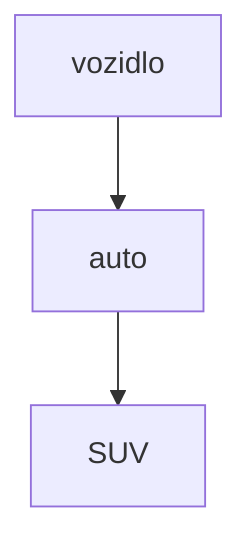
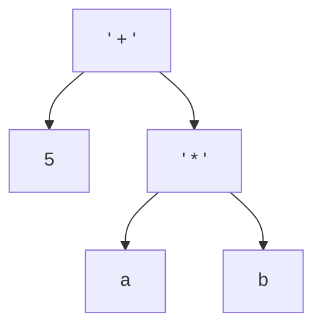
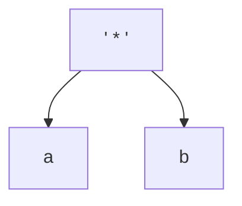

## Opakování

- Dědičnost nám umožňuje modelovat vztah mezi třídami tak, že z obecnějších tříd jsem schopni odvodit třídy konkrétnější



- Všechna **auta** jsou podmnožinou **vozidel** -> **vozidlo** je obecnější než **auto**
- Někdy instance až moc abstraktní třídy nedávají smysl
	- např. `new Vozidlo()`
- Třída `Vozidlo` se ale i tak hodí --> může obsahovat společnou logiku
- V Javě můžeme mít tzv. `abstract` neboli abstraktní třídy takové, které vypadají jako klasické třídy, ale nelze vytvořit jejich instance
	- Pro náš účel ideální
- Má to ještě další výhodu
	- Třída může obsahovat `abstract` metodu, která neobsahuje implementaci
	- V podstatě se taková metoda chová, jako by přišla z `interface`
		- Potomek je **nucen** ji implementovat
		- Díky tomu se nám **nikdy** nemůže stát, že by se nám povedlo zavolat tuto metodu bez implementace!
			- Případnou chybu se dozvíme už při sestavení programu


```java

abstract class AbstractClass {
	public abstract int abstractMethod(int param1);
}

class RegularClass extends AbstractClass {
	@Override
    public int abstractMethod(int param1) {
        return param1 * 2;
    }
}

```


## Celočíselné aritmetrické výrazy

- Mějme výraz: `5 + a * b`
- Z toho by šel vytvořit strom:



- Pojďme zkusit implementovat **vyhodnocení takového stromu**

- Problém si můžeme zjednoduššit: je to strom
	- Každý podstrom je také strom




- Každý vrchol bude jedna třída, ze které budeme dědit, abychom měnili její funkcionalitu

```java

// ani není vhodné, aby Expression mohla mít instanci
// Mohli bychom ji vytvořit OMYLEM a vznikla by chyba
// -> které se můžeme snadno vyhnout
class Expression {
	// není vhodné, aby měla implementaci
	public int evaluate() {
		return 0;
	}
}

```


```java

abstract class Expression {
	// takto donutíme každého potomka implementovat `evaluate`
	public abstract int evaluate();
}

```


- Pro násobení dvou čísel bychom `Expression` upřesnili:

```java

class MultiplyExpression extends Expression {
	private int left;
	private int right;

	public MultiplyExpression(int left, int right) {
		this.left = left;
		this.right = right;
	}
	
	@Override
	public int evaluate() {
		return left * right;
	}
	
	public String toString() {
		return "(" + left.toString() + " * " + right.toString() + ")";
	}
}

```

```java

int a = 5;
int b = 2;

Expression expression = new MultiplyExpression(a, b);
System.out.println("Result is: " + expression.evaluate());

```


- Operaci sčítání bychom vytvořili stejně

```java

class AdditionExpression extends Expression {
	private int left;
	private int right;


	public AdditionExpression(int left, int right) {
		this.left = left;
		this.right = right;
	}
	
	@Override
	public int evaluate() {
		return left.evaluate() + right.evaluate();
	}
	
	public String toString() {
		return "(" + left.toString() + " + " + right.toString() + ")";
	}
}

```


- Původní strom ale nejsme schopni vymodelovat pořádně

```java

int a = 5;
int b = 2;

Expression multiply = new MultiplyExpression(a, b);

Expression addition = new AdditionExpression(multiply.evaluate(), 5);

System.out.println("Result is: " + addition.evaluate());


```


- Ve stromu není pravý potomek `list`, který bychom klidně mohli reprezentovat `int`
	- Je tam strom:


- Pojďme třídy upravit tak, aby místo `int` používali `Expression`

```java


int a = 5;
int b = 2;

Expression multiply = new MultiplyExpression(ConstantExpression(a), ConstantExpression(b));

Expression root = new AdditionExpression(ConstantExpression(5), multiply);

System.out.println("Result is: " + root.evaluate());


```


```java

class ConstantExpression extends Expression {
	int value;

	public ConstantExpression(int value) {
		this.value = value;
	}
	
	@Override
	public int evaluate() {
		return value;
	}
}

class AdditionExpression extends Expression {
	private Expression left;
	private Expression right;

	public MultiplyExpression(Expression left, Expression right) {
		this.left = left;
		this.right = right;
	}
	
	@Override
	public int evaluate() {
		return left.evaluate() + right.evaluate();
	}
}


class MultiplyExpression extends Expression {
	private Expression left;
	private Expression right;

	public MultiplyExpression(Expression left, Expression right) {
		this.left = left;
		this.right = right;
	}
	
	@Override
	public int evaluate() {
		return left.evaluate() * right.evaluate();
	}
}

```


## Výčtové typy

- Mohlo bychom abstrahovat **binární operace** a mít tak méně redundatního kódu

```java

abstract class BinaryExpression extends Expression {
	// atributy musi byt `protected`, jinak bychom je nemohli z potomku
	// pouzivat
	protected Expression left;
	protected Expression right;

	protected BinaryExpression(Expression left, Expression right) {
		this.left = left;
		this.right = right;
	}
	
	public abstract String getOperationSymbol();
	
	// toString nyní využívá abstraktní metody getOperationSymbol
	public String toString() {
		return "(" + left.toString() + " " + getOperationSymbol() + " " + right.toString() + ")";
	}
}


// třída se nám trochu vyčistila
class AdditionExpression extends BinaryExpression {
	// nemusime definovat atributy

	public AdditionExpression(Expression left, Expression right) {
		super(left, right);
	}
	
	@Override
	public int evaluate() {
		return left.evaluate() + right.evaluate();
	}
	
	@Override
	public String getOperationSymbol() {
		return "+";
	}
}

```


- Chtělo by to ale nějak spojit operaci sčítání a jeho symbol tak, abychom mohli definovat


```java

class BinaryExpression {
	Expression left;
	Expression right;
	... operation; // ale jaký typ??
	
}

```

- Můžeme použít `String` a v `evaluate` použít `switch`, ale to není vhodné
- Místo toho Java poskytuje tzv. **výčtové typy**
- Jedná se o definici datového typu, který ale může nabývat pouze jedné z námi definovaných hodnot

```java

public enum AritmetricOperation {
	ADDITION,
	SUBTRACTION,
	MULTIPLICATION,
	DIVISION,
	MODULO
}


// ...


// Hodnoty, ktere promnenná s tímto typem může nabývat, jsou implementovány pomocí statických metod:
AritmetricOperation operation = AritmetricOperation.ADDITION;
operation = AritmetricOperation.DIVISION; // v poradku
operation = "ahoj"; // error


class AritmetricOperation {
	String operation;

	private AritmetricOperation(String operation) {
		this.operation = operation;
	}
	
	public static AritmetricOperation ADDITION = AritmetricOperation("+");
	
	// ...
}


```


- Takový typ má jednu další výhodu
	- Znemožní uživateli udělat chybu
	- Hodnotu můžeme použít ve `switch`
		- Kompilátor nás upozorní na to, že nám pro některou hodnotu chybí větev:

```java
// trida uz nemusi byt abstraktni
class BinaryExpression extends Expression {
	// atributy musi byt `protected`, jinak bychom je nemohli z potomku
	// pouzivat
	private Expression left;
	private Expression right;
	private AritmetricOperation operation;

	protected BinaryExpression(Expression left, Expression right, AritmetricOperation operation) {
		this.left = left;
		this.right = right;
		this.operation = operation;
	}
	
	@Override
	public int evaluate() {
		int lhsValue = lhs.evaluate();
		int rhsValue = rhs.evaluate();
		switch (operation) {
			case ADDITION: return lhsValue + rhsValue;
			case DIVISION: return lhsValue / rhsValue;
			case MULTIPLICATION: return lhsValue * rhsValue;
			case SUBTRACTION: return lhsValue - rhsValue;
			default:
				return 0;
		}
	}
	
}
```


- Hodnoty výčtových typů jsou technicky taky objekty
	- Mohou tedy obsahovat jiné členy

```java

public enum AritmetricOperation {
	ADDITION("+", 0),
	SUBTRACTION("-", 1),
	MULTIPLICATION("*", 2),
	DIVISION("/", 4); // vycet ruznych hodnot zakoncime `;`
	
	private final String symbol;
	private int i;
	
	private AritmetricOperation(String symbol, int i) {
		this.symbol = symbol;
		this.i = i;
	}
	
	public String getSymbol() {
		return symbol;
	}
}


// ...

AritmetricOperation operation = AritmetricOperation.ADDITION;
operation.getSymbol();

```


## Záznamy

- Často se setkáme s tím, že jediný smysl třídy je, aby reprezentovala nějakou hodnotu:
	- RGB
	- Uživatel -> logika bude spíše v `LoginManager` apod.
- Pro takové třídy bychom museli psát gettery a settery, toString apod.
	- Po čase bychom se upsali
- Naštěstí toto umí Java generovat


```java
/** osoba */
public record Person(String name, int age, double salary) { }

/** automobil */
public record Car(String regNo, String color) { }

/** bod v rovine */
public record Point(double x, double y) {
	public double distance(Point that) {
		double dx = this.x() - that.x();
		double dy = this.y() - that.y();
		return Math.sqrt(dx * dx + dy * dy);
	}
}


// ...


Person person01 = new Person("John Doe", 30, 45000);
System.out.println(person01.name());
Car blueCar = new Car("1M12 358", "blue");
```