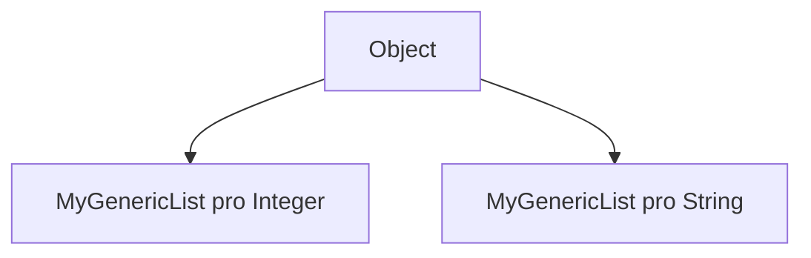

# Generické třídy a metody


## Problém:

- Chceme udělat strukturu pro seznam objektů

```java

MyList list = new MyList();
list.add(2);
list.add(6);

list.print(); // 2, 6

```

- Jaký je limit počtu prvků?
	- Musí být nějaký?


```java

public class MyStaticIntList {
    private int[] array;
    private int size;
    private int numItems;

    public MyStaticIntList(int size) {
        array = new int[size];
        this.size = size;
        numItems = 0;
    }

    public void add(int item) throws MyListOverflowException {
        if(numItems == size) {
            throw new MyListOverflowException(size);
        }

        array[numItems++] = item;
    }

    public void print() {
        // ...
    }
}

```


- Co kdybychom místo vyjímky pole prostě zvětšili

1. Vytvoříme nové pole
2. Nakopírujeme do něj prvky ze starého
3. Nahradíme referenci

```java

void add(int item) {
	if(numItems == size) {
		int newSize = size * 2;
		
		var temp = new int[newSize];
		for(int i = 0; i < size; i++) {
			temp[i] = array[i];
		}

		array = temp;
		size = newSize;
	}

	array[numItems++] = item;
}

```

- To je ale poměrně složitá logika
- Co kdybych po Vás chtěl **list** pro **double**, **String** apod.?
	- 1. byste se upsali
	- 2. byste eventuélně udělali chybu


## Trik: Použít `Object`

- Všechny třídy z něj dědí
- Když vytvoříme pole `Object`, můžeme prvkům přiřadit instanci kterékoliv třídy

```java

public class MyDynamicObjectList {
    private Object[] array;
    private int size;
    private int numItems;

    private final int INITIAL_SIZE = 10;

    public MyDynamicObjectList() {
        array = new Object[INITIAL_SIZE];
        this.size = INITIAL_SIZE;
        numItems = 0;
    }

    public void add(Object item) {
        if(numItems == size) {
            final int newSize = size * 2;
            
            var temp = new Object[newSize];
            for(int i = 0; i < size; i++) {
                temp[i] = array[i];
            }

            array = temp;
            size = newSize;
        }

        array[numItems++] = item;
    }

    public void print() {
        for(int i = 0; i < numItems; i++) {
            System.out.print(array[i]);
            if(i < numItems - 1) {
                System.out.print(", ");
            }
        }

        System.out.println();
    }
}

```


- Tohle bude normálně fungovat

```java

MyDynamicObjectList list = new MyDynamicObjectList();
list.add("Ahoj");
list.add("Test");

list.print(); // Ahoj, Test

```


### Problém č.1

- Můžeme pokaždé přiřadit jiný typ:

```java

MyDynamicObjectList list = new MyDynamicObjectList();
list.add("Ahoj");
list.add(new Car("blue", "382 093"));
list.add(new MyDynamicObjectList());

```

- Pokud bychom dostali takovou instanci listu, těžko by se nám s ní pracovalo
	- Nemohli bychom implementovat třeba `sum` apod.


### Problém č.2

- Pokud bychom chtěli s listem pracovat, museli bychom každý prvek přetypovat ručně

```java


MyDynamicObjectList list = new MyDynamicObjectList();
list.add(new Light("red"));
list.add(new Light("yellow"));
list.add(new Light("green"));


public static void turnOnLights(MyDynamicObjectList lights) {
	for (int i = 0; i < lights.size(); i++) {
		((Light) lights.get(i)).turnOn();
	}
}


```


## Generické třídy

- Potřebovali bychom:
	- Aby Java sama z našeho vzoru vygenerovala třídu pro každý typ:

```java
public class MyDynamicDoubleList {
    private double[] array;
    private int size;
    private int numItems;

    private final int INITIAL_SIZE = 10;

    public MyDynamicIntList() {
        array = new double[INITIAL_SIZE];
        this.size = INITIAL_SIZE;
        numItems = 0;
    }

    public void add(int item) {
        if(numItems == size) {
            final int newSize = size * 2;
            var temp = new double[newSize];
            for(int i = 0; i < size; i++) {
                temp[i] = array[i];
            }

            array = temp;
            size = newSize;
        }

        array[numItems++] = item;
    }
}
```

```java
public class MyDynamicStringList {
    private String[] array;
    private int size;
    private int numItems;

    private final int INITIAL_SIZE = 10;

    public MyDynamicIntList() {
        array = new String[INITIAL_SIZE];
        this.size = INITIAL_SIZE;
        numItems = 0;
    }

    public void add(int item) {
        if(numItems == size) {
            final int newSize = size * 2;
            var temp = new String[newSize];
            for(int i = 0; i < size; i++) {
                temp[i] = array[i];
            }

            array = temp;
            size = newSize;
        }

        array[numItems++] = item;
    }
}
```


## Generické třídy

- Genericita nám umožňuje přesně to
- **Generické třídy** jsou takové, u kterých můžeme určit typy až při práci s ní
	- Nikoliv už při definici
- Při definici určujeme pouze **generické parametry**, a to do <> závorek, hned za název třídy:


```java


public class MyGenericList<T> {
    private T[] array;
    private int size;
    private int numItems;

    private final int INITIAL_SIZE = 10;

    public MyGenericList() {
        array = (T[])new Object[INITIAL_SIZE];
        this.size = INITIAL_SIZE;
        numItems = 0;
    }

    public void add(T item) {
        if(numItems == size) {
            final int newSize = size * 2;
            var temp = (T[])new Object[newSize];
            for(int i = 0; i < size; i++) {
                temp[i] = array[i];
            }

            array = temp;
            size = newSize;
        }

        array[numItems++] = item;
    }
}


```


```java

MyGenericList<Integer> list = new MyGenericList<Integer>();
list.add(4);
list.add(16);
list.add(32);
list.add(48);

list.print();

list.add(new Car("yellow", "513 513")); // error

```


```java

public static int sumList(MyGenericList<Integer> list) {
	int sum = 0;
	for(int i = 0; i < list.size(); i++) {
		sum += list.get(i);
	}

	return sum;
}

```


## Upřesnění parametrů

- Občas ale nechceme, aby uživatel mohl použít libovolný typ
- Občas chceme specifikovat alespoň **interface**, který musí typ implementovat
	- Např. `Shape`

```java

public class Point<T> {
	private final T x;
	private final T y;
	
	public Point(T x, T y) {
		this.x = x;
		this.y = y;
	}
	
	public double distance(Point<T> that) {
		return ???; // co tady? Do pythagorovy věty nenarveme třeba String
	}
}

```


- Naštěstí můžeme **upřesnit**, jak má použitý typ vypadat

```java

public class Point<T implements Shape> {
	// ...
	
	public double distance(Point<T> that) {
		double dx = this.x.doubleValue() - that.x.doubleValue();
		double dy = this.y.doubleValue() - that.y.doubleValue();
		return Math.sqrt(dx * dx - dy * dy);
	}

}

```


## Metody s generickými typy

- Dvě instance generické třídy s dvěma různými generickými parametry, **nejsou stejný typ**
	- Java na generickou třídu nahlíží opravdu jako šablonu




- pro print out chceme, aby prvky byly co nejobecnější

```java

public static void printOut(MyGenericList<Object> list) {
	for (int i = 0; i < list.size(); i++) {
		System.out.println(list.get(i));
	}
}

MyGenericList<Object> objects = new MyGenericList<Object>(10);
MyGenericList<Integer> integers = new MyGenericList<Integer>(10);
printOut(objects);
printOut(integers); // nelze přeložit, 

```


### Žolík

```java

public static void printOut(MyGenericList<?> list) {
	for (int i = 0; i < list.size(); i++) {
		System.out.println(list.get(i));
	}
}

```

- Opět můžeme upřesnit

```java

public static double average(MyGenericList<? extends Number> numbers) {
	if (numbers.size() == 0) return Double.NaN;
	
	double total = 0;
	for (int i = 0; i < numbers.size(); i++) {
		Number value = numbers.get(i);
		total += value.doubleValue();
	}
	
	return total / numbers.size();
}

```


## Generické metody

- Generické parametry můžeme uvést i u metod

```java

public static <T> boolean areEqual(T objectA, T objectB) {
	return objectA.equals(objectB);
}

```

- Ty můžeme kombinovat s generickými parametry

```java

public static <T> void fill(int count, T object, MyGenericList<T> list) {
	for (int i = 0; i < count ; i++)
		list.add(object);
}

// ...

MyList<String> list = new MyList<String>(10);
fill(10, "abc", list);
fill(10, false, list); // nelze přeložit

```